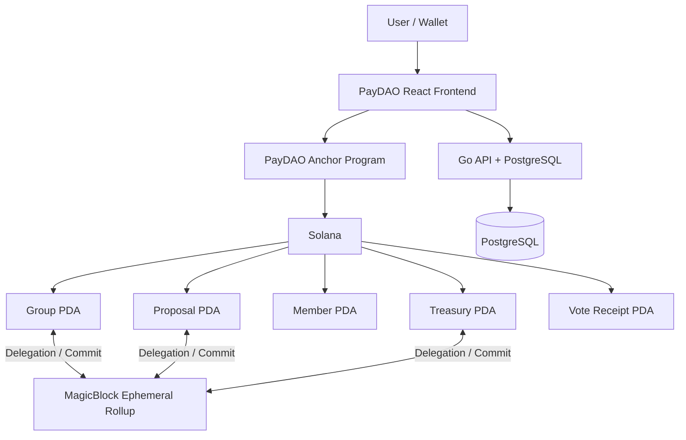
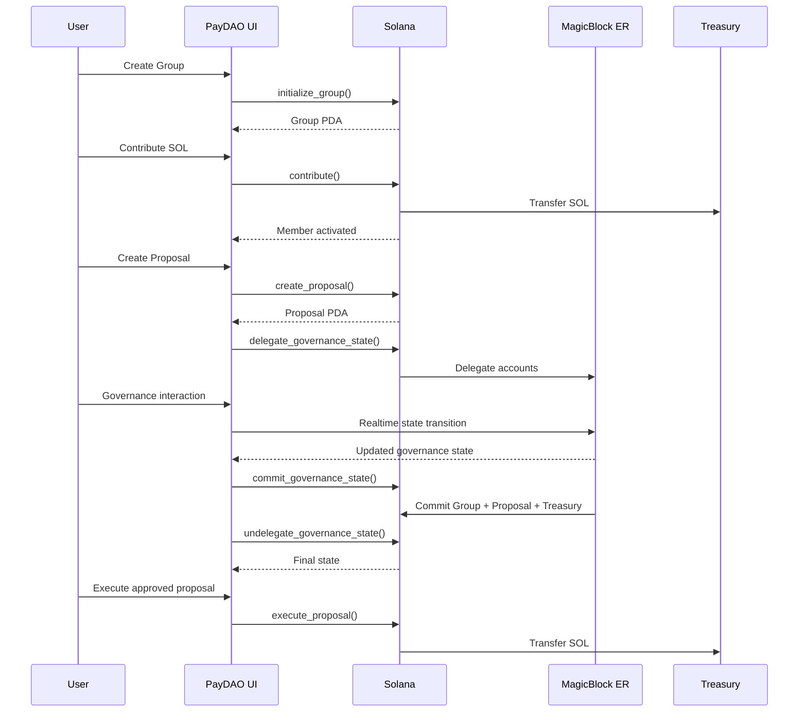

# PayDAO

> **Collaborative treasury governance powered by Solana + MagicBlock Ephemeral Rollups.**

PayDAO is a decentralized collaborative funding platform built for the **BlitzX Hackathon**.

It allows communities to create shared funding groups, contribute SOL, create funding proposals, vote, and execute approved treasury payments.

The core idea is simple:

**Solana secures the treasury and final state. MagicBlock makes governance state fast and realtime.**

---

## ⚡ Why MagicBlock?

Traditional Solana applications require every interactive state transition to execute directly on the base layer.

For a governance application, this can create a poor interaction model:

```text
User
  ↓
Solana transaction
  ↓
Network confirmation
  ↓
State update
  ↓
Next interaction
```

PayDAO uses **MagicBlock Ephemeral Rollups (ER)** to introduce a fast execution environment for delegated governance state.

Instead of treating governance as a sequence of isolated base-layer transactions, PayDAO can delegate active governance accounts to a MagicBlock Ephemeral Rollup, perform realtime state transitions there, and later commit the resulting state back to Solana.

```text
                 SOLANA
                   │
          Durable governance state
                   │
                   │ delegate
                   ▼
        ┌─────────────────────┐
        │   MAGICBLOCK ER     │
        │                     │
        │  Realtime state     │
        │  Governance logic   │
        │  Fast transitions   │
        │                     │
        └─────────────────────┘
                   │
                   │ commit
                   ▼
                 SOLANA
             Final state
```

This is the primary reason MagicBlock is important to PayDAO.

---

# 🧠 What PayDAO Does

PayDAO turns community funding into an on-chain governance workflow.

```text
Create Group
     ↓
Fund Treasury
     ↓
Become Member
     ↓
Create Proposal
     ↓
Vote
     ↓
Reach Decision
     ↓
Treasury Payment
```

The treasury is controlled by the Anchor program.

There is no backend administrator who can withdraw the funds.

---

# 🏗️ Architecture



---

# 🔥 MagicBlock Integration

MagicBlock is integrated directly into the Anchor program.

The program uses:

```rust
use ephemeral_rollups_sdk::anchor::{
    commit,
    delegate,
    ephemeral,
};

use ephemeral_rollups_sdk::cpi::DelegateConfig;
use ephemeral_rollups_sdk::ephem::MagicIntentBundleBuilder;
```

The program is also marked with:

```rust
#[ephemeral]
#[program]
pub mod paydao_proof {
    ...
}
```

This makes MagicBlock a part of the actual on-chain program architecture rather than something implemented only in the frontend.

---

# ⚡ 1. Ephemeral Rollup Program

PayDAO uses MagicBlock's Anchor integration through:

```rust
#[ephemeral]
#[program]
pub mod paydao_proof
```

This enables the program to participate in the Ephemeral Rollup execution model.

The important concept is that selected PayDAO accounts can be delegated to an ER validator.

Once delegated, those accounts can be operated on inside the fast execution environment.

---

# 🔀 2. Account Delegation

PayDAO supports delegation of three important governance accounts:

### Group

```rust
pub fn delegate_group(
    ctx: Context<DelegateGroup>,
) -> Result<()>
```

### Proposal

```rust
pub fn delegate_proposal(
    ctx: Context<DelegateProposal>,
) -> Result<()>
```

### Treasury

```rust
pub fn delegate_treasury(
    ctx: Context<DelegateTreasury>,
) -> Result<()>
```

Each delegation uses MagicBlock's:

```rust
DelegateConfig
```

and can specify an ER validator.

For example:

```rust
ctx.accounts.delegate_group(
    &ctx.accounts.payer,
    &[
        GROUP_SEED,
        group.creator.as_ref(),
        &group.group_key,
    ],
    DelegateConfig {
        validator,
        ..Default::default()
    },
)?;
```

This is where PayDAO hands the selected account to the MagicBlock execution environment.

---

# 🔄 3. Realtime Governance State

PayDAO includes a dedicated realtime instruction:

```rust
pub fn realtime_heartbeat(
    ctx: Context<RealtimeHeartbeat>,
) -> Result<()> {
    ctx.accounts.group.realtime_nonce =
        ctx.accounts.group.realtime_nonce
            .checked_add(1)
            .ok_or(ErrorCode::Overflow)?;

    Ok(())
}
```

The `realtime_nonce` exists specifically to demonstrate mutable Group state while the account participates in the delegated environment.

Conceptually:

```text
Solana Group PDA
       │
       │ delegate
       ▼
MagicBlock ER
       │
       │ realtime_heartbeat()
       │
       │ nonce++
       │
       ▼
Updated delegated state
```

This demonstrates the core MagicBlock capability PayDAO is using:

> **Governance state can move into a fast execution environment and be updated there before being committed back to Solana.**

---

# 💾 4. Commit Back to Solana

After governance activity occurs in the Ephemeral Rollup, PayDAO can commit the state back to Solana.

The program uses:

```rust
MagicIntentBundleBuilder
```

For example:

```rust
MagicIntentBundleBuilder::new(
    ctx.accounts.payer.to_account_info(),
    ctx.accounts.magic_context.to_account_info(),
    ctx.accounts.magic_program.to_account_info(),
)
.commit(&[
    ctx.accounts.group.to_account_info(),
])
.build_and_invoke()?;
```

PayDAO provides commit instructions for:

* Group
* Proposal
* Treasury

and also provides an atomic governance commit.

---

# 🧩 5. Atomic Governance Commit

The most important commit path is:

```rust
pub fn commit_governance_state(
    ctx: Context<CommitGovernanceState>,
) -> Result<()>
```

It commits:

```text
Group
Proposal
Treasury
```

together.

```rust
.commit(&[
    ctx.accounts.group.to_account_info(),
    ctx.accounts.proposal.to_account_info(),
    ctx.accounts.treasury.to_account_info(),
])
```

This gives PayDAO a clean governance lifecycle:

```text
        SOLANA
           │
           │ delegate
           ▼
    ┌─────────────┐
    │ MagicBlock  │
    │     ER      │
    └─────────────┘
           │
           │ governance activity
           ▼
    Group + Proposal
    + Treasury state
           │
           │ atomic commit
           ▼
        SOLANA
```

---

# 🔙 6. Commit + Undelegate

PayDAO also supports:

```rust
pub fn undelegate_governance_state(
    ctx: Context<CommitGovernanceState>,
) -> Result<()>
```

using:

```rust
.commit_and_undelegate(&[
    ctx.accounts.group.to_account_info(),
    ctx.accounts.proposal.to_account_info(),
    ctx.accounts.treasury.to_account_info(),
])
```

This performs the final transition:

```text
MagicBlock ER
      │
      │ commit_and_undelegate
      ▼
Solana ownership/state
```

The application can therefore return governance state from the Ephemeral Rollup back to the Solana base layer.

---

# 🏛️ PayDAO Governance Architecture

PayDAO's governance state is divided into several PDAs.

```text
                    GROUP PDA
                       │
          ┌────────────┼────────────┐
          │            │            │
          ▼            ▼            ▼
      Treasury      Members      Proposals
                                    │
                                    ▼
                              Vote Receipts
```

### Group PDA

Contains:

* group creator
* group metadata
* target amount
* current treasury balance
* reserved funds
* member count
* proposal count
* voting threshold
* quorum
* deadline
* realtime nonce

### Treasury PDA

Holds the group's SOL.

```text
Treasury PDA
    │
    │ controlled by Anchor
    ▼
SOL
```

The backend never receives treasury authority.

### Member PDA

Created when a wallet contributes.

```text
Wallet
   │
   │ contribute SOL
   ▼
Treasury
   │
   ▼
Member PDA
```

Contribution therefore becomes the membership mechanism.

### Proposal PDA

Contains:

* proposal creator
* title
* description
* requested amount
* recipient
* voting deadline
* vote aggregates
* voter count
* proposal status

### Vote Receipt PDA

Prevents a wallet from voting twice on the same proposal.

---

# 💰 Treasury Flow

The treasury is controlled by the Anchor program.

```text
Contributor
     │
     │ contribute()
     ▼
┌──────────────┐
│ Treasury PDA │
└──────────────┘
     │
     │ proposal approved
     ▼
 Recipient
```

The backend cannot withdraw funds.

The frontend cannot directly move treasury SOL.

Only the program's treasury execution logic can release proposal funds.

---

# 🗳️ Governance Flow

A typical PayDAO proposal follows:

```text
Proposal Created
       │
       ▼
     Voting
       │
       ├───────────────┐
       │               │
       ▼               ▼
    Approved         Rejected
       │               │
       ▼               ▼
 Treasury Payment    Funds Released
       │
       ▼
    Executed
```

PayDAO requires all members to participate before the final governance decision.

The proposal's YES/NO/ABSTAIN values are maintained as aggregate counters.

---

# ⚙️ Automatic Treasury Settlement

Once all required votes have been received, PayDAO calculates the approval ratio.

```text
YES
────────────── × 10,000
YES + NO
```

The result is compared against:

```rust
group.voting_threshold_bps
```

If the threshold is reached, the proposal can execute the treasury payment.

The internal execution function:

```rust
execute_treasury_payment(...)
```

updates:

```text
Treasury balance
Reserved funds
Proposal status
```

atomically within the program instruction.

---

# 🔐 On-Chain Security

The Anchor program enforces the critical treasury and governance rules.

### PDA constraints

PayDAO derives:

```text
Group
Treasury
Member
Proposal
VoteReceipt
```

using deterministic PDA seeds.

### Treasury protection

The program verifies:

* treasury belongs to the group
* treasury contains sufficient SOL
* proposal amount is reserved
* recipient matches proposal recipient
* proposal is in a valid state

### Proposal protection

A proposal cannot execute unless:

```text
status == Passed
```

and the treasury has sufficient funds.

### Double voting protection

Vote receipts use:

```text
["vote", proposal, voter]
```

which allows one receipt per wallet per proposal.

---

# 🪄 Where MagicBlock Fits

MagicBlock is specifically used for the **governance execution layer**.

| Layer           | Technology               | Purpose                            |
| --------------- | ------------------------ | ---------------------------------- |
| Base blockchain | Solana                   | Durable state and settlement       |
| Smart contract  | Anchor                   | Governance + treasury rules        |
| Fast execution  | MagicBlock ER            | Delegated realtime state execution |
| Delegation      | MagicBlock SDK           | Move selected accounts to ER       |
| Realtime state  | ER                       | Fast governance state transitions  |
| Commit          | MagicIntentBundleBuilder | Commit delegated state             |
| Finalization    | Commit + Undelegate      | Return state to Solana             |

The architecture can be summarized as:

```text
                  PAYDAO
                    │
          ┌─────────┴─────────┐
          │                   │
       Solana             MagicBlock
          │                   │
   Durable state        Fast execution
   Treasury              Governance
   Settlement            Realtime state
          │                   │
          └─────────┬─────────┘
                    │
                 Commit
                    │
                    ▼
                 Solana
```

---

# 🚀 Why This Architecture?

PayDAO deliberately separates:

### Solana

Used for:

* durable ownership
* treasury custody
* final state
* program-enforced rules
* SOL settlement

### MagicBlock

Used for:

* delegated governance state
* realtime execution
* fast state transitions
* governance interaction lifecycle
* committing state back to Solana

This gives PayDAO the best architectural split:

> **Solana provides the security boundary. MagicBlock provides the realtime execution environment.**

---

# 🧪 MagicBlock Flow

The demonstrated MagicBlock lifecycle is:

```text
1. initialize_group
        │
        ▼
2. Group PDA created on Solana
        │
        ▼
3. delegate_group
        │
        ▼
4. Group delegated to MagicBlock ER
        │
        ▼
5. realtime_heartbeat
        │
        ▼
6. Group state changes on ER
        │
        ▼
7. commit_governance_state
        │
        ▼
8. Group + Proposal + Treasury
   committed back to Solana
        │
        ▼
9. undelegate_governance_state
        │
        ▼
10. Solana resumes authoritative state
```

---

# 🛠️ Technology Stack

## Blockchain

* Solana
* Solana System Program

## Smart Contract

* Rust
* Anchor
* `anchor-lang`

## MagicBlock

* MagicBlock Ephemeral Rollups
* `ephemeral-rollups-sdk`
* Anchor MagicBlock integration
* `#[ephemeral]`
* `#[delegate]`
* `#[commit]`
* `DelegateConfig`
* `MagicIntentBundleBuilder`

## Frontend

* React
* TypeScript
* Vite
* React Router
* Framer Motion
* Lucide React
* Solana Wallet Adapter

## Backend

* Go
* PostgreSQL
* HTTP API
* Server-Sent Events

## Infrastructure

* Docker
* Docker Compose

---

# 📁 Project Structure

```text
paydao/
│
├── chain/
│   ├── programs/
│   │   └── paydao-proof/
│   │       ├── src/
│   │       │   └── lib.rs
│   │       └── Cargo.toml
│   │
│   ├── tests/
│   │   └── paydao-proof.ts
│   │
│   ├── Anchor.toml
│   └── Cargo.toml
│
├── src/
│   ├── chain/
│   │   └── paydao.ts
│   │
│   ├── components/
│   ├── pages/
│   ├── services/
│   ├── store/
│   └── types/
│
├── backend/
│   ├── cmd/
│   ├── migrations/
│   └── Dockerfile
│
└── README.md
```

---

# 🔄 Complete PayDAO Flow



---

# 🏆 Why PayDAO for BlitzX?

PayDAO is not using MagicBlock as a cosmetic integration.

MagicBlock is part of the application's execution architecture.

The project demonstrates how a DAO-style treasury application can combine:

```text
          SOLANA
     Secure settlement
           +
       MAGICBLOCK
    Fast governance
           +
         ANCHOR
   Enforced governance
           =
         PAYDAO
```

The key idea is:

> **Move active governance state where it can execute quickly, then commit the resulting state back to Solana where the treasury and durable state remain secure.**

This allows PayDAO to explore a more realtime governance experience without moving treasury custody away from Solana.

---

# 📜 Program

PayDAO Anchor program:

```text
Eo8z84VpZvhf86i6c9yzmrfMcjSGwT6hhYfjhK6HugvG
```

Cluster:

```text
Solana Devnet
```

---

# 🏁 Running the Project

### Frontend

```bash
npm install
npm run dev
```

### Backend

```bash
cd backend
docker compose up --build
```

### Anchor / MagicBlock

```bash
cd chain

npm install

anchor build
```

For the devnet integration flow:

```bash
anchor test --skip-build --skip-deploy --skip-local-validator
```

The MagicBlock integration test demonstrates the delegated-account lifecycle and realtime state transition.

---

# 🎯 Hackathon Demo

The ideal PayDAO demo is:

```text
Create Group
     ↓
Fund Treasury
     ↓
Create Proposal
     ↓
Delegate Governance State
     ↓
MagicBlock ER
     ↓
Realtime Governance
     ↓
Commit State
     ↓
Return to Solana
     ↓
Treasury Settlement
```

The important part to demonstrate to judges is not simply that PayDAO has a DAO UI.

It is that **MagicBlock is actually involved in the lifecycle of the application's governance state.**

---

# 🔮 Future Direction

PayDAO can evolve toward:

* richer realtime governance interactions
* browser-side MagicBlock ER integration
* more granular delegated account workflows
* improved governance UX
* private voting through a dedicated privacy architecture
* server-side Solana indexing
* SPL-token treasury support
* production deployment and security auditing

---

## Built for BlitzX

**PayDAO — Collaborative funding and governance with Solana + MagicBlock.**

> **Secure treasury on Solana. Realtime governance with MagicBlock.**
