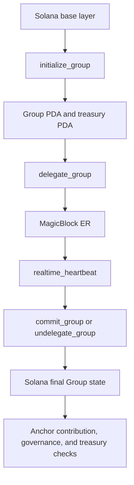
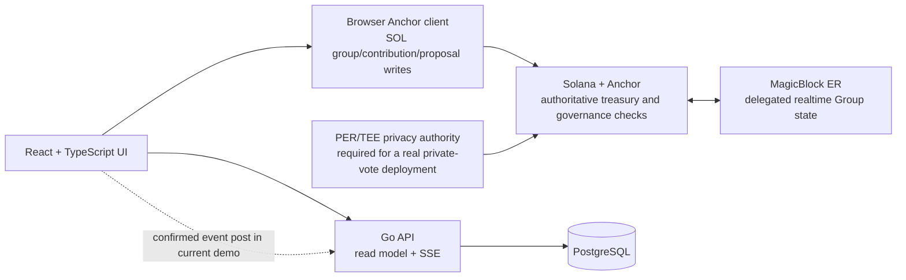

# PayDAO

> A Solana and MagicBlock prototype for collaborative SOL funding, member-gated proposals, aggregate governance settlement, and permissionless treasury execution.

PayDAO is a MagicBlock hackathon project. Its on-chain core is an Anchor program that creates funding groups, accepts SOL contributions, activates contributor membership, creates proposals, settles aggregate vote counts through a configured privacy authority, and lets anyone execute a passed proposal after the contract checks the execution conditions.

This repository is **hackathon-ready but not a production deployment**. The Anchor program and MagicBlock ER lifecycle compile and have a devnet-oriented integration test. The browser app has real SOL transactions for group creation, contributions, and proposal creation. Other screens still contain local demo data, and the browser does not yet implement a real PER/TEE voter client.

## Status At A Glance

| Area                                                                   | Current state                                                                                      |
| ---------------------------------------------------------------------- | -------------------------------------------------------------------------------------------------- |
| Anchor group, member, proposal, vote-receipt, and treasury accounts    | Implemented in `chain/programs/paydao-proof/src/lib.rs`                                            |
| SOL group creation from the browser                                    | Implemented through `src/chain/paydao.ts`                                                          |
| SOL contribution and membership activation from the browser            | Implemented                                                                                        |
| SOL proposal creation from the browser                                 | Implemented; recipient must be a valid base58 Solana public key                                    |
| MagicBlock ER delegation, realtime heartbeat, commit, and undelegation | Implemented in the Anchor program and `chain/tests/paydao-proof.ts`                                |
| Private voting through PER/TEE                                         | **Not implemented in the browser**; on-chain aggregate settlement trusts `Group.privacy_authority` |
| Permissionless treasury execution                                      | Implemented as `execute_proposal`; a caller must submit the transaction                            |
| Go PostgreSQL read model and SSE stream                                | Implemented in `backend/`                                                                          |
| Server-side Solana/MagicBlock indexer                                  | Not implemented; browser posts confirmed events to the internal API in the current demo            |
| USDC/PAY token flows                                                   | Not implemented; current chain client supports SOL only                                            |
| Production authentication                                              | Not implemented; login is a local demo gate                                                        |
| Formal audit, mainnet deployment, hosted demo                          | Not present in this repository                                                                     |

## Why PayDAO?

Collaborative funding needs more than a payment form. A group needs a verifiable treasury, a membership rule, a way for eligible contributors to propose spending, governance state that can update quickly, and a settlement path that does not depend on a private administrator clicking “approve.”

PayDAO uses a contribution as the membership action:

```text
Contributor
    |
    | contribute(lamports)
    v
SOL treasury PDA
    |
    | confirmed on Solana
    v
Member PDA becomes active
    |
    v
Member can create proposals
```

The current implementation is intentionally narrower than the product vision: the working chain path is SOL-only, aggregate vote settlement is restricted to a configured authority, and PER/TEE voter authorization is still a required integration task.

## Key Features

- Public group creation with a target amount, description, deadline, visibility flag, and voting threshold.
- Separate treasury PDA owned by the system program and funded through the Anchor program.
- Contributor membership created by the contribution instruction. There is no on-chain `join_group` instruction.
- Member-gated proposal creation.
- Aggregate vote counts (`yes`, `no`, `abstain`) and a nullifier receipt account; individual vote choices are not stored in the program’s public proposal account.
- Deadline, quorum, threshold, recipient, treasury-balance, proposal-status, and one-time execution checks in Anchor.
- Permissionless execution: anyone can submit `execute_proposal` after the proposal is passed.
- MagicBlock ER delegation for fast delegated Group state updates, followed by commit/undelegation back to Solana.
- Go PostgreSQL read model with privacy-safe SSE activity events.
- Existing retro/pixel React interface with group, proposal, wallet, activity, and payment views.

## Why MagicBlock?

### The Solana-only problem

Solana is the authority for PayDAO’s durable state and money movement, but repeatedly submitting interactive governance updates directly to the base layer is not the best UX for a realtime voting experience. The base layer also does not provide privacy merely because the UI hides a field: ordinary Solana transactions are observable.

### What MagicBlock adds here

The repository uses the MagicBlock Rust SDK with the `anchor` feature and the following ER primitives:

- `#[ephemeral]` program support.
- `#[delegate]` account delegation.
- `DelegateConfig` with a selected ER validator.
- `#[commit]` account context support.
- `MagicIntentBundleBuilder` for commit and commit-and-undelegate.
- A devnet integration test that delegates the PayDAO Group PDA, runs `realtime_heartbeat` on the ER, and undelegates it.

MagicBlock is therefore part of the state lifecycle, not merely a dashboard label:



The current browser client does **not** perform delegation or connect to a MagicBlock ER. Those operations are proven in the Anchor integration test. The next browser integration should use a generated IDL and the current MagicBlock client/RPC flow rather than duplicating the hand-authored minimal IDL in `src/chain/paydao.ts`.

### ER is not private voting

An ordinary Ephemeral Rollup provides fast delegated execution; it does not automatically hide wallet identity or individual vote choice. The program’s `record_vote_aggregate` instruction accepts only aggregate counts and requires the signer to equal `Group.privacy_authority`. The contract does not prove that this signer is a TEE or PER service.

A production privacy deployment would need to:

1. Run voter interaction through MagicBlock PER/TEE infrastructure.
2. Authorize eligible voters through the TEE flow.
3. Keep individual vote records and wallet-to-vote mappings out of the public API and public chain state.
4. Submit only a verified aggregate settlement through the configured privacy authority.
5. Define and audit how the authority proves that aggregate counts represent eligible, non-duplicated votes.

That PER/TEE client and proof are not implemented in this repository yet.

## Architecture



### Component responsibilities

| Component         | Owns                                                                                                                                                    | Does not own                                                          |
| ----------------- | ------------------------------------------------------------------------------------------------------------------------------------------------------- | --------------------------------------------------------------------- |
| Anchor program    | Group configuration, member eligibility, proposal state, aggregate vote settlement authorization, treasury transfer checks, MagicBlock delegation hooks | User profiles, search, notifications, arbitrary backend authorization |
| Solana base layer | Durable account state, system-owned treasury PDA, final transaction settlement                                                                          | Low-latency UI transport                                              |
| MagicBlock ER     | Delegated account execution and realtime state updates in the tested lifecycle                                                                          | Automatic vote privacy; ordinary ER state is public                   |
| PER/TEE authority | Intended confidential vote collection and aggregate submission boundary                                                                                 | It is not present as a working browser client in this repository      |
| React frontend    | Wallet signing, forms, display, local UI read model, API/SSE subscription                                                                               | Treasury authority, final proposal status, vote authorization         |
| Go API            | PostgreSQL read model, event ingestion endpoint, public group reads, SSE activity                                                                       | Treasury custody and on-chain authorization                           |
| PostgreSQL        | Indexed group, proposal, contribution, and activity records                                                                                             | Blockchain truth                                                      |

## How It Works

### 1. Create a group

The browser calls `initialize_group` through `src/chain/paydao.ts`.

The instruction creates:

- A Group PDA derived from the creator and a random 16-byte `group_key`.
- A separate treasury PDA derived from the Group PDA.
- Group metadata and governance configuration.

The current browser path supports SOL only. The program stores name, description, visibility, target lamports, deadline, threshold, quorum, and privacy authority.

### 2. Contribute

The browser calls `contribute(lamports)`. Anchor transfers SOL from the contributor signer into the treasury PDA and updates `Group.current_lamports`.

The same instruction initializes or updates the contributor’s Member PDA. A successful contribution is the membership action.

### 3. Become a member

There is no `join_group` instruction. A Member PDA exists after a valid contribution and is required by `create_proposal`.

The creator is not automatically inserted as a member by `initialize_group`.

### 4. Create a proposal

A contributor with a Member PDA can call `create_proposal` with:

- title
- description
- amount in lamports
- recipient public key
- voting deadline

The program checks that the requested amount does not exceed the recorded treasury balance. The recipient must be a non-default `Pubkey`; the browser therefore requires a valid base58 Solana address.

### 5. Private voting boundary

The current contract does not expose a public `vote` instruction that records wallet-specific choices. Instead, `record_vote_aggregate` accepts aggregate deltas and creates a receipt PDA keyed by a caller-provided nullifier.

The signer must equal `Group.privacy_authority`. This is a trusted authority boundary until PER/TEE authorization and an aggregate-proof design are implemented. The current frontend refuses to claim that a vote was recorded because no PER/TEE voter client exists.

### 6. Finalize

Anyone can call `finalize_proposal` once either:

- the voting deadline has passed, or
- the aggregate voter count reaches the group member count.

The program computes quorum and the yes ratio, then changes the proposal status to `Passed` or `Rejected`.

### 7. Execute

Anyone can call `execute_proposal` for a `Passed` proposal. Anchor checks:

- proposal status is `Passed`
- treasury balance is sufficient
- recipient account matches the immutable proposal recipient
- treasury PDA is the expected PDA

The treasury PDA signs the system-program transfer with PDA seeds. The proposal is then marked `Executed`. Execution is permissionless-triggered, not a backend job and not automatic without a transaction submitter.

### 8. Commit to Solana

The tested MagicBlock lifecycle delegates the Group PDA, runs `realtime_heartbeat` on the ER, and calls `undelegate_group`, which commits and returns ownership to the program. `commit_group` is also present for an explicit commit without undelegation.

## Privacy & Trust Model

### Public or indexed data

The code and read model can expose:

- group metadata
- target amount and recorded balance
- contribution amounts
- anonymous contributor labels generated by the backend
- proposal metadata
- aggregate vote counters when supplied to the program
- proposal status
- execution transaction/signature when indexed

### Intended private data

The product intends to keep private:

- voter identity
- wallet-to-vote mapping
- individual vote choice
- raw private vote records

The current repository does not yet implement the PER/TEE voter client. Do not interpret the current aggregate authority as a cryptographic proof of private voting. The `privacy_authority` key is selected at group initialization and the program checks only that the transaction signer matches it.

### Trust boundaries

**Cryptographically enforced by Anchor:** PDA derivation constraints, signer checks, member-PDA requirement for proposals, arithmetic checks, deadlines, proposal status, quorum/threshold calculation, recipient matching, treasury balance, and one-way execution status.

**Trusted or incomplete:** the authority that submits aggregate votes, the correctness of aggregate counts, browser-posted indexer events, local demo authentication, and the generated/manual frontend IDL.

**Backend limitation:** the Go API is not allowed to withdraw funds and is not the authority for governance. In the current demo it accepts browser-posted chain events; a production deployment needs a server-side Solana/MagicBlock indexer with authenticated ingestion.

## Governance Model

| Rule             | Current implementation                                                                   |
| ---------------- | ---------------------------------------------------------------------------------------- |
| Group admin      | No admin-only treasury instruction exists                                                |
| Membership       | Valid contribution creates/updates a Member PDA                                          |
| Proposal creator | Must provide a Member PDA for the group                                                  |
| Vote storage     | Aggregate counters plus a nullifier receipt; no public wallet-to-choice array            |
| Quorum           | Group initializes with `quorum_bps = 5000` and finalization rounds the required count up |
| Threshold        | Configured at group creation in basis points                                             |
| Finalization     | Permissionless after deadline or full participation                                      |
| Execution        | Permissionless after `Passed`; the submitter pays the transaction fee                    |

## Treasury Model

- Funds are held in a system-owned Treasury PDA derived from `['treasury', group_pubkey]`.
- Contributors sign SOL transfers into that PDA through Anchor.
- The Go backend cannot withdraw from the treasury.
- Proposals name an immutable recipient public key and requested lamport amount.
- Only the Anchor `execute_proposal` instruction can release funds through the program’s checks.
- The current implementation supports SOL. SPL-token vaults for USDC/PAY are not implemented.

## Smart Contract

### Program identity

- Program name: `paydao_proof`
- Program ID in `chain/Anchor.toml` and `declare_id!`: `ADodoyipRDjhu9esEbgsDd2bE8E5rme7o3UZx2uLS6m4`
- Cluster configuration: devnet

The browser client has an older hard-coded fallback ID. Set `VITE_PAYDAO_PROGRAM_ID` explicitly to the deployed program ID before using the browser. Do not rely on the fallback.

### Program instructions

| Instruction             | Purpose                                                  | Authority / important checks                                                       |
| ----------------------- | -------------------------------------------------------- | ---------------------------------------------------------------------------------- |
| `initialize_group`      | Create Group and Treasury PDAs and configure governance  | Creator signer; validates text length, visibility, target, threshold, and deadline |
| `contribute`            | Transfer SOL to treasury and create/update membership    | Contributor signer; positive amount, active group, deadline, checked arithmetic    |
| `create_proposal`       | Create a proposal account                                | Creator signer plus Member PDA; amount cannot exceed recorded group balance        |
| `realtime_heartbeat`    | Mutate delegated Group state for the ER proof            | Any caller accepted by the current account context; checked nonce increment        |
| `record_vote_aggregate` | Add aggregate yes/no/abstain counts and create a receipt | `privacy_authority` signer; proposal deadline/status and member-count cap          |
| `finalize_proposal`     | Resolve `Voting` to `Passed` or `Rejected`               | Permissionless; deadline/full-participation, quorum, and threshold checks          |
| `execute_proposal`      | Transfer SOL from treasury to proposal recipient         | Permissionless; passed status, balance, recipient, PDA seeds, and one-time status  |
| `delegate_group`        | Delegate Group PDA to a selected ER validator            | Payer signer; MagicBlock delegation CPI                                            |
| `commit_group`          | Commit delegated Group state                             | Payer signer; `MagicIntentBundleBuilder`                                           |
| `undelegate_group`      | Commit and return Group ownership to the program         | Payer signer; `MagicIntentBundleBuilder`                                           |

### PDA and account architecture

```text
Group PDA
  seeds: ["group", creator_pubkey, group_key_16_bytes]
       |
       +-- Treasury PDA
       |   seeds: ["treasury", group_pubkey]
       |
       +-- Member PDA per contributor
       |   seeds: ["member", group_pubkey, contributor_pubkey]
       |
       +-- Proposal PDA per proposal
       |   seeds: ["proposal", group_pubkey, proposal_count_le_bytes]
       |
       +-- VoteReceipt PDA per aggregate nullifier
           seeds: ["vote", proposal_pubkey, nullifier_32_bytes]
```

### Important account fields

- `Group`: creator, bounded name/description, visibility, random group key, target/current lamports, member/proposal counters, threshold/quorum, deadline, privacy authority, active flag, realtime nonce, bump.
- `Member`: group, wallet, cumulative contribution, bump.
- `Proposal`: group, ID, creator, title/description, amount, recipient, voting deadline, aggregate counts, voter count, status, bump.
- `VoteReceipt`: proposal, nullifier, bump.

### Proposal statuses

The program uses numeric status values represented by `ProposalStatus`:

```text
Voting -> Passed -> Executed
Voting -> Rejected
```

## Technology Stack

### Blockchain

- Solana devnet configuration
- Solana system program for SOL transfers

### Smart contracts

- Rust
- Anchor program model
- `anchor-lang` configured at `1.0.2` in the chain program
- MagicBlock `ephemeral-rollups-sdk` from its Git repository with the Anchor feature

### Privacy and execution

- MagicBlock Ephemeral Rollup delegation/commit/undelegation in the Anchor program and test
- PER/TEE is an intended privacy boundary, not a completed browser integration

### Backend

- Go
- `github.com/jackc/pgx/v5`
- HTTP JSON API
- Server-Sent Events

### Frontend

- React 18
- TypeScript
- Vite
- Tailwind CSS
- Framer Motion
- Lucide React
- Anchor and `@solana/web3.js` browser clients
- React Router

### Database

- PostgreSQL 16 in Docker

### Infrastructure and tooling

- Docker Compose
- Anchor CLI and Solana CLI for chain deployment/tests
- Node.js/npm for the root app and chain test harness
- Rust/Cargo for the Anchor program

## Project Structure

```text
paydao/
├── backend/
│   ├── cmd/api/main.go                Go HTTP API, PostgreSQL setup, SSE, event ingestion
│   ├── migrations/001_init.sql        Database schema source
│   ├── cmd/api/migrations/001_init.sql Embedded migration used by the binary
│   ├── Dockerfile
│   ├── docker-compose.yml
│   ├── go.mod
│   └── README.md
├── chain/
│   ├── programs/paydao-proof/
│   │   ├── src/lib.rs                 Anchor program
│   │   └── Cargo.toml
│   ├── tests/paydao-proof.ts          Devnet/MagicBlock lifecycle test
│   ├── Anchor.toml
│   ├── Cargo.toml
│   ├── package.json
│   ├── tsconfig.json
│   └── README.md
├── src/
│   ├── chain/paydao.ts                Browser Anchor client for current SOL writes
│   ├── services/paydaoApi.ts          Go API and SSE client
│   ├── components/                    Retro UI, layout, modals, and UI primitives
│   ├── pages/                         Dashboard, groups, proposals, wallet, etc.
│   ├── store/AppContext.tsx           Local read model and transaction orchestration
│   ├── data/mockData.ts               Demo data used by unindexed/local screens
│   ├── types/index.ts
│   └── App.tsx
├── docs/
│   ├── magicblock-phase-1.md          MagicBlock notes and proof runbook
│   └── assets/architecture/           Place architecture screenshots here
├── .env.example                       Safe configuration template; no secrets
├── package.json
├── vite.config.ts
├── tailwind.config.js
└── README.md
```

## Getting Started

### Prerequisites

Verified from the repository configuration:

- Node.js and npm for the Vite app. The root project has no `engines` field; use a current Node.js release compatible with Vite 5 and the lockfile.
- Rust and Cargo for the Anchor program.
- Anchor CLI compatible with the `anchor_version = "1.0.2"` entry in `chain/Anchor.toml`.
- Solana CLI and a funded devnet keypair at `~/.config/solana/id.json` for the chain test/deploy flow.
- Docker and Docker Compose for PostgreSQL and the Go API.
- A browser Solana wallet for browser writes, such as Phantom or Backpack. The browser client expects an injected `window.solana` provider.

The current development machine used for this repository has Cargo/Rust and Docker, but does not have `anchor` or `solana` installed. Install those before running the chain commands.

### Install root frontend dependencies

```bash
npm install
```

### Install chain test dependencies

```bash
cd chain
npm install
cd ..
```

The chain test uses the dependencies declared in `chain/package.json`; it is separate from the root Vite app.

### Environment variables

Copy the safe template:

```bash
cp .env.example .env.local
```

Do not upload private keys, seed phrases, wallet JSON files, TEE tokens, database passwords, or API secrets into this repository or into the architecture assets directory. Use a local ignored `.env.local`, a secret manager, or your CI provider’s secret store.

| Variable                      | Purpose                                                      | Required for                               |
| ----------------------------- | ------------------------------------------------------------ | ------------------------------------------ |
| `VITE_API_URL`                | Go API base URL; defaults to `http://localhost:8080`         | Frontend indexed groups/SSE                |
| `VITE_SOLANA_RPC`             | Solana RPC used by browser Anchor client; defaults to devnet | Browser group/contribution/proposal writes |
| `VITE_PAYDAO_PROGRAM_ID`      | Deployed PayDAO program ID                                   | Browser writes; set this explicitly        |
| `DATABASE_URL`                | PostgreSQL connection string                                 | Go API                                     |
| `PORT`                        | Go API port; defaults to `8080`                              | Go API                                     |
| `FRONTEND_ORIGIN`             | CORS allow-origin                                            | Go API production hardening                |
| `INDEXER_SECRET`              | Optional server-to-server event-ingestion secret             | Production indexer ingestion               |
| `EPHEMERAL_PROVIDER_ENDPOINT` | MagicBlock ER RPC for the Anchor test                        | Chain ER test                              |
| `EPHEMERAL_WS_ENDPOINT`       | MagicBlock ER WebSocket endpoint for the Anchor test         | Chain ER test                              |
| `VALIDATOR`                   | Optional MagicBlock validator identity override              | Chain ER test                              |

### Run the backend

From `backend/`:

```bash
docker compose up --build
```

The API listens on `http://localhost:8080`. Verify it:

```bash
curl http://localhost:8080/healthz
```

Expected response:

```json
{"status":"ok"}
```

### Run the frontend

From the repository root:

```bash
npm run dev
```

Vite normally serves the app at `http://localhost:5173`.

The login screen is a local demo gate. Any non-empty email and password are accepted; no backend authentication is performed.

## API Documentation

### `GET /healthz`

Checks database connectivity.

### `GET /api/v1/groups`

Returns public groups from PostgreSQL. The response is an indexed read model, not a direct authoritative chain read.

### `GET /api/v1/groups/{id}`

Returns one indexed group by its database ID.

### `GET /api/v1/realtime`

Opens an SSE stream. Events are privacy-safe activity objects with group ID, event type, message, status, and timestamp. The stream must not carry voter wallet identities or individual vote choices.

### `POST /internal/v1/chain-events`

Accepts an event payload from the current browser integration or a future server-side indexer. Required fields are `type`, `groupId`, and `signature`. In production, set `INDEXER_SECRET` and send the `X-Indexer-Secret` header from a trusted server-side indexer.

Example development event:

```json
{
  "type": "group_created",
  "groupId": "<group-pda>",
  "groupAddress": "<group-pda>",
  "signature": "<solana-signature>",
  "name": "Security Fund",
  "description": "Community audit funding",
  "amountLamports": "1000000000",
  "currency": "SOL",
  "visibility": "public",
  "thresholdBps": 6000,
  "memberCount": 0
}
```

The API derives a deterministic anonymous contributor label from the event signature for contribution records. This is an application label, not a cryptographic anonymity guarantee.

## Anchor and MagicBlock Development

From `chain/`:

```bash
npm install
anchor build
```

Deploy to devnet after configuring a funded wallet:

```bash
solana config set --url https://api.devnet.solana.com
solana airdrop 2
anchor deploy --provider.cluster devnet
```

Run the integration test:

```bash
anchor test --skip-build --skip-deploy --skip-local-validator
```

The test assumes:

- the program is already deployed;
- the local Anchor provider is configured for devnet;
- the wallet is funded;
- `https://devnet-as.magicblock.app/` is reachable;
- the selected ER validator is available.

The test flow is:

```text
initialize_group on Solana
        |
        v
delegate_group to MagicBlock ER
        |
        v
realtime_heartbeat on ER
        |
        v
undelegate_group: commit + return ownership
        |
        v
contribute SOL -> Member PDA
        |
        v
create_proposal -> aggregate vote settlement -> finalize -> execute
```

There is no local MagicBlock validator configuration in this repository. The current test uses the devnet ER endpoint and the Asia validator default from the test file.

## Frontend User Flows

### Implemented chain-backed flow

1. Open Groups.
2. Select Create Group.
3. Choose `SOL` explicitly.
4. Connect/unlock an injected Solana wallet.
5. Sign `initialize_group`.
6. After confirmation, the app adds the group to its local read model and posts a chain event to the Go API.
7. Open the group and contribute SOL.
8. After confirmation, contribution state is updated locally and an event is posted to the API.
9. Create a proposal using a valid base58 recipient public key.

### Demo/local flows

Dashboard charts, wallet balances, payments, member lists, notifications, many transactions, and initial group/proposal data come from `src/data/mockData.ts` and browser `localStorage`. They are useful for the visual demo but are not authoritative chain reads.

### Voting flow

The UI shows aggregate-style voting panels, but `AppContext.voteOnProposal` deliberately throws until a PER/TEE voter client exists. No local vote is recorded and the frontend must not claim that a private vote succeeded.

## Testing and Validation

### Root frontend

```bash
npm run typecheck
npm run build
npm run lint
```

The build and typecheck are currently passing in the repository. The lint configuration reports existing unrelated errors in legacy UI/demo files; lint is not currently a clean gate.

### Go backend

```bash
cd backend
go test ./...
```

There are currently no Go test files; this command compiles the API package.

### Anchor/MagicBlock

```bash
cd chain
anchor build
anchor test --skip-build --skip-deploy --skip-local-validator
```

This is the only substantive integration test. It requires devnet credentials and reachable MagicBlock infrastructure. There are no frontend unit tests, browser tests, or formal security tests in the repository.

## Deployment

### Local development

- Run PostgreSQL and the API with `docker compose up --build` from `backend/`.
- Run Vite with `npm run dev` from the root.
- The chain test uses devnet by default; no local Solana validator or local MagicBlock stack is configured here.

### Devnet

1. Install compatible Anchor and Solana CLIs.
2. Configure `~/.config/solana/id.json`.
3. Fund the wallet on devnet.
4. Confirm the program ID in `chain/Anchor.toml` matches `declare_id!` and `VITE_PAYDAO_PROGRAM_ID`.
5. Run `anchor build` and `anchor deploy --provider.cluster devnet`.
6. Set frontend RPC/program variables.
7. Run the integration test.
8. Start PostgreSQL/API and the frontend.

### Mainnet

No mainnet deployment configuration, hosted RPC, production indexer, production authentication, audit, or hosted frontend is included. Do not treat the devnet configuration as mainnet-ready.

## Two-to-Five-Minute Hackathon Demo

The strongest honest demo path is:

1. Start the Go API with Docker and the Vite app.
2. Show the PayDAO group interface and the architecture diagram.
3. Use a funded devnet wallet and select SOL in Create Group.
4. Sign `initialize_group` and show the Solana signature.
5. Contribute SOL and explain that the Member PDA is created by the same instruction.
6. Create a proposal with a real recipient address.
7. Run the Anchor/MagicBlock integration test or show its recorded output: Group delegation, realtime heartbeat, and commit/undelegation.
8. Explain that private voting is the next PER/TEE milestone; do not claim the current browser has completed it.
9. Explain that passed-proposal execution is permissionless in Anchor, but requires a caller to submit the transaction.

## Security Considerations

Verified protections in the current Anchor program:

- PDA seed constraints for Group, Treasury, Member, Proposal, and VoteReceipt accounts.
- Signer requirements for creation, contribution, privacy-authority aggregate settlement, delegation, and commit operations.
- Positive amount and target checks.
- Checked arithmetic for counters, balances, vote counts, and realtime nonce.
- Group and proposal deadline checks.
- Member-PDA requirement for proposal creation.
- Proposal amount cannot exceed the group’s recorded balance at creation.
- Aggregate vote count cannot exceed the group’s member count.
- Finalization requires deadline/full participation plus quorum and threshold calculations.
- Execution requires `Passed`, sufficient balance, matching recipient, and a treasury PDA signer transfer.
- Proposal status changes to `Executed` after transfer, preventing a second execution through the same status gate.

## Known Limitations

- The current browser client uses a hand-authored minimal IDL and its fallback program ID is stale relative to the current `Anchor.toml`; always set `VITE_PAYDAO_PROGRAM_ID` explicitly.
- The browser does not delegate/read from MagicBlock ER. ER usage is currently proven by the Anchor integration test.
- PER/TEE/private voter authorization is not implemented. `privacy_authority` is a trusted configured signer, not proof that votes were privately and correctly tallied.
- Aggregate vote receipt nullifiers are stored, but the program does not independently prove that a nullifier maps to a unique eligible voter or that the submitted aggregate is correct.
- `record_vote_aggregate` can be called by the configured authority with aggregate counts; the authority model needs a formal privacy-proof design and audit.
- The Go backend is a read model and accepts browser-posted events in local mode. It is not a trustless Solana indexer.
- Indexed group balances can lag or differ from chain state because the current backend is not listening directly to Solana/MagicBlock events.
- Frontend login is a local demo gate and accepts any non-empty credentials.
- Most wallet, payments, transactions, notifications, and charts are mock/local data.
- Only SOL is supported by current chain-backed browser flows. USDC and PAY are UI/mock options, not implemented SPL-token treasury flows.
- Proposal recipients must be public keys, although some legacy UI copy/examples use human-readable labels.
- The program has not been formally audited.
- No production rate limits, monitoring, secret manager integration, migration runner, or backup policy is included.
- Docker uses development PostgreSQL credentials.

## Key Design Decisions

- **Treasury custody stays in Anchor:** the Go service cannot arbitrarily release funds.
- **Contribution creates membership:** this removes a separate join transaction and makes eligibility verifiable through a Member PDA.
- **No admin withdrawal path:** proposal execution is governed by proposal state and on-chain checks.
- **Permissionless execution:** anyone can pay the transaction fee to trigger a passed proposal; no administrator is required.
- **Separate delegated state from treasury:** the tested MagicBlock ER lifecycle delegates the Group PDA, while treasury transfer authority remains enforced by the Anchor program.
- **Aggregate public state, private intended inputs:** the program stores aggregate counts and nullifier receipts, while the intended PER/TEE layer keeps individual vote data out of public state. The privacy proof is not complete yet.
- **Go is a read model:** indexing and realtime transport should improve UX without becoming a second treasury authority.

## What Makes PayDAO Different?

The project combines three concrete primitives in one flow:

1. A contribution is both funding and membership activation.
2. A Group PDA can be delegated to MagicBlock ER infrastructure for realtime state transitions and later committed back to Solana.
3. A passed proposal can release treasury SOL through a permissionless Anchor instruction with no admin approval transaction.

The differentiator is not that all of these are production-complete today. It is that the repository contains the on-chain enforcement boundary and the MagicBlock lifecycle needed to evolve the demo toward realtime private governance without moving treasury authority into the backend.

## Roadmap

### Current

- SOL Group/Treasury/Member/Proposal/VoteReceipt account model.
- Anchor checks for contribution, proposal, finalization, and execution.
- MagicBlock ER delegation/heartbeat/commit-and-undelegate integration test.
- Browser SOL group, contribution, and proposal transactions.
- Go PostgreSQL read model and SSE activity endpoint.
- Existing retro/pixel frontend shell and demo pages.

### Next

- Generate and ship the Anchor IDL to the frontend instead of maintaining a minimal hand-authored IDL.
- Fix program ID/config synchronization and validate browser transactions against the deployed program.
- Add browser MagicBlock Router/ER delegation and realtime reads.
- Implement a real PER/TEE voter authorization/client flow.
- Define and verify aggregate vote proofs, voter eligibility, and nullifier uniqueness.
- Replace browser-posted events with a server-side Solana/MagicBlock indexer.
- Expose indexed proposal/contribution/activity reads through the Go API.
- Replace demo authentication with wallet-based identity/session handling.

### Future

- SPL-token vaults for USDC and a defined PAY token.
- Audited Magic Actions integration for post-commit operations where appropriate.
- Production observability, rate limits, secret management, migrations, backups, and deployment automation.
- Mainnet deployment after audit and privacy/security review.

## Secure Configuration and Uploads

Use `.env.example` as the safe configuration template. Never upload secrets into Git, issue attachments, `docs/assets`, or screenshots.

For local secret material:

```text
.env.local                 ignored local frontend values
backend/.env               local backend values; do not commit
~/.config/solana/id.json   local Solana wallet; never upload
```

For an architecture screenshot, place a sanitized image at:

```text
docs/assets/architecture/paydao-architecture.png
```

The directory is intentionally present for hackathon screenshots. Remove wallet addresses, RPC tokens, TEE tokens, database passwords, and private URLs before adding an image.

## Contributing

1. Create a focused branch.
2. Keep treasury authorization in Anchor; do not add backend withdrawal paths.
3. Preserve the privacy rule: never add wallet-to-vote or individual vote data to public activity/API payloads.
4. Run root typecheck/build, backend tests, and the Anchor compile check for relevant changes.
5. Document whether a feature is chain-backed, indexed, mock-only, or planned.

## License

No license is currently specified in this repository. Do not assume the code is licensed for redistribution until a license is added by the project owner.

## Acknowledgements

- [Solana](https://solana.com/)
- [Anchor](https://www.anchor-lang.com/)
- [MagicBlock](https://www.magicblock.gg/) and the [MagicBlock documentation](https://docs.magicblock.gg/)
- [PostgreSQL](https://www.postgresql.org/)
- [React](https://react.dev/)
